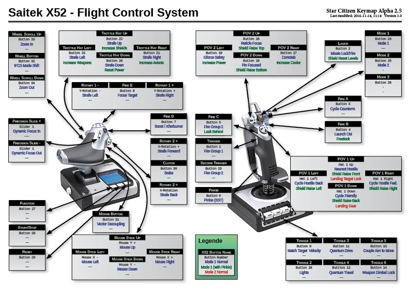

# README - Saitek X52 Star Citizen Profile

## Purpose

The purpose is to cover almost all functions Star Citizen provide with the **Saitek X52 Flight Control System** (HOTAS).

Current **Star Citizen Version**: Alpha 2.5.

You can find the discussion in the forum on [https://forums.robertsspaceindustries.com/discussion/355717/download-saitek-x52-profile-mapping-fight-mode-plus-advanced-controls-with-pinkie-switch](https://forums.robertsspaceindustries.com/discussion/355717/download-saitek-x52-profile-mapping-fight-mode-plus-advanced-controls-with-pinkie-switch)

## Disclaimer

This Profile is claimed as "alpha" and in continous development. You might use it on your own risk. 

Also there might be missing a lot of functions. I am not the best pilot and since now i can only test on an Aurora. This ship is very buggy and limitated in 2.5. There is no HUD, shield levels can't be assigned and so on. Some functions I just don't understand yet (due to function-limitation of my Aurora or brain-limitation of myself).

## What's in?

Saitek X52 Profile for Saitek X52 Flight Control System and Key Mapping for StarCitizen. 

|File|Function|
|---|---|
|[StarCitizen.pr0](StarCitizen.pr0)|Profile for Saitek Profile Editor|
|[layout_JoystickSaitekX52_SC.xml](layout_JoystickSaitekX52_SC.xml)|StarCitizen XML-Profile for Saitek X52|
|[Saitek_X52_KeyMap_SC.pdf](Saitek_X52_KeyMap_SC.pdf)|Saitek X52 Keymap as pdf file for printing purpose or to have it open on second screen or whatever. Shows the mapping of all buttons and states of the profile.|

## Functions

The profile uses the pinkie-Stick for more functionality of the Saitek X52 to cover the most functions Star Citizen provide.

Basically there are three modes right now. The normal fight mode (Mode 1), the extended Mode 1 (with pressed pinkie switch) and a non-fight profile (Mode 2).

|Profile|Name|Function|
|---|---|---|
|Mode 1|Fight|Main Profile with main buttons for fighting|
|Mode 1 + Pinkie|Fight|Extends the Fight Profile, eg. Shield- and Powermanagement|
|Mode 2|Common Stuff|This Mode is used for things, when not in fight modus. Eg. deploy landing gear, quantum travel, social stuff... is still in development|

## How to install?

Basically you have to import the *StarCitizen.pr0* into the Saitek Editor and activate it. And you have to copy the star-citizen-xml to your *STAR_CITIZEN_INSTALL_FOLDER\Public\USER\Controls\Mappings\*.

1. Pull or download this repository. Extract if downloades as zip.
2. Open Saitek Profile Editor and import the *StarCitizen.pr0*.
3. Activate the profile.
4. Copy *layout_JoystickSaitekX52_SC.xml* to your *STAR_CITIZEN_INSTALL_FOLDER\Public\USER\Controls\Mappings\*.
5. In Star Citizen go to Options -> Keymapping -> Joystick -> advanced.
 - Import Profile *JoystickSaitekX52* and map it to you joystick.
6. Enjoy.

## Thanks and Comments
Thank to the Citizen [R-M-C](https://forums.robertsspaceindustries.com/profile/166490/R-M-C), who inspired me in [this threat](https://forums.robertsspaceindustries.com/discussion/216133/saitek-x52-pro-key-mapping-templates-profiles-v-2-0/p1) to adapt his X52 Pro Template to the *normal* X52.

Maybe there are some german words in the profile ... you can keep them :)
